# Analytics Module

## Module 2 - Data Analytics & Exploratory Data Analysis

---

## Overview

The Analytics module performs exploratory data analysis (EDA) and statistical analysis on the Titanic dataset available through Seaborn. It demonstrates a complete analytics workflow beginning with dataset profiling, followed by data preprocessing, statistical analysis, visualization, multivariate storytelling, and feature standardization.

The module has been implemented as a modular Python application following software engineering best practices. Each analytical task has been separated into an independent service class to improve readability, maintainability, and reusability.

The implementation strictly follows the IIT Patna Capstone Project Module 2 (Part A) requirements.

---

## Objectives

The objectives of this module are:

- Load the Titanic dataset using `sns.load_dataset("titanic")`.
- Perform exploratory data analysis.
- Profile the dataset.
- Handle missing values using rule-based preprocessing.
- Perform univariate statistical analysis.
- Perform bivariate relationship analysis.
- Build a multivariate data story using multiple visualizations.
- Demonstrate feature standardization using z-score normalization.
- Generate reproducible reports and visualizations.

---

## Technology Stack

| Category | Technology |
|-----------|------------|
| Language | Python 3.13 |
| Data Manipulation | Pandas |
| Numerical Computing | NumPy |
| Visualization | Matplotlib, Seaborn |
| Machine Learning Utilities | Scikit-learn |
| Logging | Python logging |
| Dataset | Seaborn Titanic Dataset |

---

## Project Structure

```text
analytics/
│
├── config/
│   ├── logging_config.py
│   └── settings.py
│
├── datasets/
│   └── titanic_loader.py
│
├── outputs/
│   ├── cleaned_titanic.csv
│   │
│   ├── figures/
│   │   ├── age_boxplot.png
│   │   ├── age_distribution_by_survival.png
│   │   ├── age_histogram.png
│   │   ├── age_standardization.png
│   │   ├── correlation_heatmap.png
│   │   ├── fare_boxplot.png
│   │   ├── fare_histogram.png
│   │   ├── fare_standardization.png
│   │   ├── fare_vs_age_survival.png
│   │   ├── survival_by_passenger_class.png
│   │   └── survival_by_sex.png
│   │
│   └── reports/
│       ├── correlation_matrix.csv
│       ├── dataset_profile.csv
│       ├── missing_value_handling_report.csv
│       ├── multivariate_story.md
│       ├── standardization_summary.csv
│       ├── survival_rate_by_pclass.csv
│       ├── survival_rate_by_sex.csv
│       ├── survival_rate_by_sex_pclass.csv
│       ├── top_correlations.csv
│       └── univariate_statistics.csv
│
├── services/
│   ├── bivariate_analysis.py
│   ├── eda.py
│   ├── multivariate_analysis.py
│   ├── preprocessing.py
│   ├── standardization_check.py
│   └── univariate_analysis.py
│
├── main.py
├── README.md
└── requirements.txt
```

---

# Dataset

This project uses the Titanic dataset provided by the Seaborn library.

```python
import seaborn as sns

dataframe = sns.load_dataset("titanic")
```

The dataset is downloaded automatically by Seaborn during the first execution and subsequently loaded from the local cache. No manual dataset download is required.

### Dataset Summary

| Property | Value |
|----------|------:|
| Records | 891 |
| Features | 15 |
| Target Variable | survived |
| Missing Values | Present |
| Numerical Features | age, fare, sibsp, parch, pclass |
| Categorical Features | sex, embarked, class, deck, embark_town |

---

# Running the Project

Clone the repository.

```bash
git clone <repository-url>
```

Create a virtual environment.

```bash
python -m venv .venv
```

Activate the environment.

Windows

```bash
.venv\Scripts\activate
```

Install dependencies.

```bash
pip install -r requirements.txt
```

Execute the analytics pipeline.

```bash
python analytics/main.py
```

Upon successful execution, all reports, processed datasets, and visualizations are generated inside the `outputs` directory.

---

# Task A.1 - Dataset Profiling

## Objective

The first task focuses on understanding the Titanic dataset before performing any preprocessing or statistical analysis. Dataset profiling provides insights into the dataset's structure, data types, descriptive statistics, and missing values, enabling informed preprocessing decisions.

---

## Implementation

The Titanic dataset is loaded using Seaborn's built-in dataset loader.

```python
import seaborn as sns

dataframe = sns.load_dataset("titanic")
```

The following exploratory checks are performed:

- Dataset shape
- Dataset information (`info()`)
- Summary statistics (`describe(include="all")`)
- Missing value percentage for each column
- Backup of the original dataset

---

## Dataset Profile

| Property | Value |
|----------|------:|
| Number of Records | 891 |
| Number of Features | 15 |
| Target Variable | survived |
| Numeric Features | age, fare, sibsp, parch, pclass |
| Categorical Features | sex, embarked, class, deck, embark_town |

---

## Missing Value Analysis

The percentage of missing values was calculated for every column.

| Column | Missing (%) |
|---------|------------:|
| age | 19.87 |
| embarked | 0.22 |
| embark_town | 0.22 |
| deck | 77.22 |

These statistics were later used to determine the preprocessing strategy implemented in Task A.2.

---

## Outputs Generated

### Dataset Backup

```
outputs/titanic.csv
```

### Console Output

The analytics pipeline prints:

- Dataset shape
- Dataset information
- Summary statistics
- Missing value percentages

This provides immediate visibility into the characteristics of the dataset before any preprocessing.

---

## Key Findings

- The Titanic dataset contains **891 passenger records**.
- Four columns contain missing values.
- The `deck` column has a very high percentage of missing values (77.22%), making direct imputation unreliable.
- The `age` column has moderate missing values (19.87%), making it suitable for statistical imputation.
- The remaining missing values occur in less than 1% of the records.

---

# Task A.2 - Missing Value Handling

## Objective

The purpose of this task is to preprocess missing values using a rule-based strategy defined by the assignment rubric.

Rather than applying a single imputation technique to every feature, each column is treated independently according to its percentage of missing values.

---

## Missing Value Strategy

The following threshold-based strategy was implemented.

| Missing Percentage | Strategy |
|-------------------:|----------|
| Less than 5% | Drop rows containing missing values |
| Between 5% and 30% | Median imputation |
| Greater than 30% | Drop the column |

---

## Column-wise Decisions

### Age

- Missing Percentage: **19.87%**
- Strategy: **Median Imputation**

**Justification**

The missing percentage falls within the 5% to 30% threshold specified in the rubric. Median imputation preserves the dataset size while minimizing the influence of extreme age values.

---

### Embarked

- Missing Percentage: **0.22%**
- Strategy: **Drop Rows**

**Justification**

Since the missing percentage is significantly below 5%, removing the affected rows has a negligible impact on the dataset while avoiding unnecessary imputation.

---

### Embark Town

- Missing Percentage: **0.22%**
- Strategy: **Drop Rows**

**Justification**

The proportion of missing records is extremely small. Dropping these rows maintains data quality without affecting statistical validity.

---

### Deck

- Missing Percentage: **77.22%**
- Strategy: **Drop Column**

**Justification**

More than three-quarters of the values are missing. Imputing such a large proportion would introduce significant uncertainty and could distort subsequent analyses. Therefore, the column was removed from the cleaned dataset.

---

## Outputs Generated

### Cleaned Dataset

```
outputs/cleaned_titanic.csv
```

### Missing Value Report

```
outputs/reports/missing_value_handling_report.csv
```

The report records:

- Column name
- Missing percentage
- Selected preprocessing strategy
- Justification for the chosen strategy

---

## Execution Summary

The preprocessing module logs the measured missing percentage for every affected column before applying the selected strategy.

Example:

```
Column 'age' has 19.87% missing values.
Strategy selected: Median Imputation.

Column 'deck' has 77.22% missing values.
Strategy selected: Drop Column.
```

This ensures that every preprocessing decision is transparent and directly traceable to the assignment's threshold-based rules.

---

## Key Findings

- Missing values were handled independently for each column.
- The preprocessing strategy strictly followed the rubric-defined thresholds.
- The cleaned dataset retained the maximum amount of reliable information while avoiding inappropriate imputation.
- All preprocessing decisions were documented in a dedicated report for reproducibility.

---

# Task A.3 - Univariate Analysis

## Objective

The objective of this task is to analyze individual numerical variables independently to understand their central tendency, dispersion, distribution, and presence of outliers.

The analysis was performed on the following numerical features:

- Age
- Fare

For each feature, descriptive statistics and graphical visualizations were generated.

---

## Statistical Measures

The following statistics were calculated for each feature.

- Mean
- Median
- Mode
- First Quartile (Q1)
- Third Quartile (Q3)
- Interquartile Range (IQR)
- Lower Bound
- Upper Bound
- Number of Outliers
- Distribution Type

Outliers were identified using the IQR rule.

```
Lower Bound = Q1 − 1.5 × IQR

Upper Bound = Q3 + 1.5 × IQR
```

---

## Age Analysis

### Statistical Summary

| Statistic | Value |
|-----------|------:|
| Mean | 29.32 |
| Median | 28.00 |
| Mode | 28.00 |
| Q1 | 22.00 |
| Q3 | 35.00 |
| IQR | 13.00 |
| Lower Bound | 2.50 |
| Upper Bound | 54.50 |
| Number of Outliers | 65 |
| Distribution | Right Skewed |

### Histogram

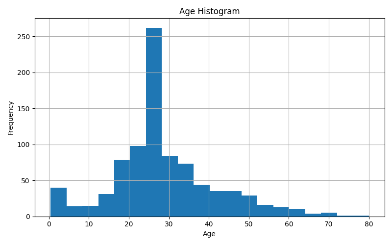

### Box Plot

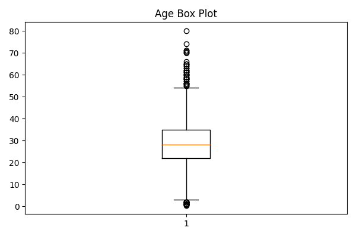

### Interpretation

The age distribution is positively skewed, indicating a larger concentration of younger passengers with fewer elderly passengers. The box plot identifies several passengers above the upper whisker as outliers, representing unusually old ages. Although outliers exist, they represent valid observations and were retained for analysis.

---

## Fare Analysis

### Statistical Summary

| Statistic | Value |
|-----------|------:|
| Mean | 32.10 |
| Median | 14.45 |
| Mode | 8.05 |
| Q1 | 7.90 |
| Q3 | 31.00 |
| IQR | 23.10 |
| Lower Bound | -26.76 |
| Upper Bound | 65.66 |
| Number of Outliers | 114 |
| Distribution | Right Skewed |

### Histogram

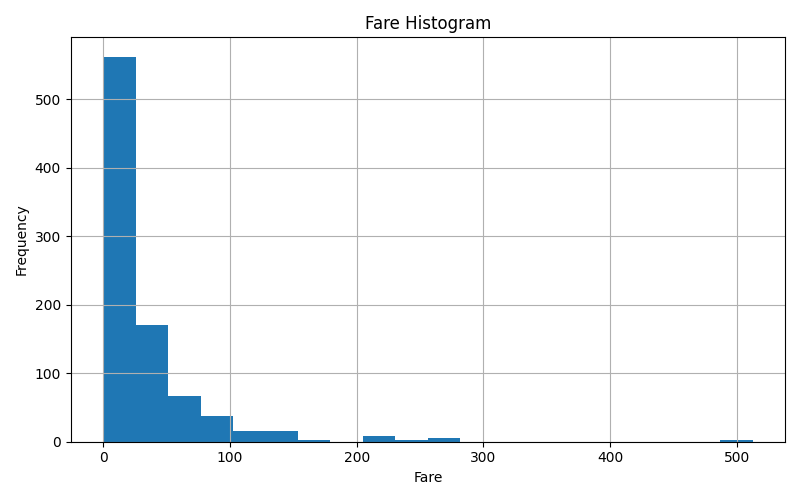

### Box Plot

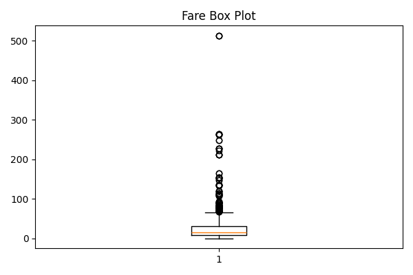

### Interpretation

The fare distribution is highly right skewed with several high-value ticket prices appearing as outliers. The large difference between the mean and median indicates that a small number of expensive tickets increase the average fare considerably. These observations are expected because first-class passengers paid significantly higher fares.

---

## Outputs Generated

### Figures

```
outputs/figures/

age_histogram.png
age_boxplot.png
fare_histogram.png
fare_boxplot.png
```

### Reports

```
outputs/reports/

univariate_statistics.csv
```

---

## Key Findings

- Both Age and Fare exhibit right-skewed distributions.
- Fare contains considerably more extreme values than Age.
- The IQR method successfully identified potential outliers.
- Outliers were retained because they represent genuine passenger records rather than data-entry errors.

---

# Task A.4 - Bivariate Analysis

## Objective

The objective of this task is to investigate relationships between pairs of variables and determine how passenger characteristics influenced survival.

The analysis consisted of two parts:

1. Survival rate analysis using Boolean masking.
2. Correlation analysis of numerical features.

---

## Survival Rate Analysis

Boolean masking using logical operators (`&` and `|`) was used to calculate survival rates for different passenger groups.

The following analyses were performed.

### Survival Rate by Sex

| Sex | Survival Rate (%) |
|-----|------------------:|
| Female | 74.04 |
| Male | 18.89 |

The analysis demonstrates that female passengers experienced substantially higher survival rates than male passengers.

---

### Survival Rate by Passenger Class

| Passenger Class | Survival Rate (%) |
|----------------|------------------:|
| First | 62.62 |
| Second | 47.28 |
| Third | 24.24 |

Passengers travelling in higher classes experienced considerably better survival outcomes.

---

### Survival Rate by Sex and Passenger Class

| Sex | Passenger Class | Survival Rate (%) |
|------|----------------|------------------:|
| Female | First | 96.74 |
| Female | Second | 92.11 |
| Female | Third | 50.00 |
| Male | First | 36.89 |
| Male | Second | 15.74 |
| Male | Third | 13.54 |

This combined analysis highlights the interaction between passenger class and sex. Female passengers travelling in first class had the highest survival probability, while male passengers in third class experienced the lowest survival rate.

---

## Correlation Analysis

A Pearson correlation matrix was computed using the following six numerical variables.

- survived
- pclass
- age
- sibsp
- parch
- fare

The derived Boolean columns (`adult_male` and `alone`) were intentionally excluded because they are redundant features derived from other variables.

---

### Correlation Heatmap

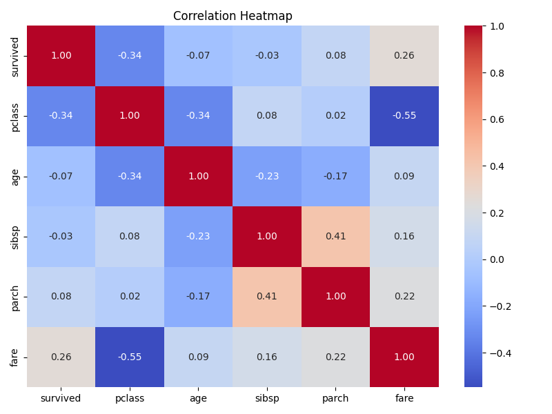

---

## Strongest Correlations

The strongest relationships were identified by ranking the absolute values of the off-diagonal correlation coefficients.

| Rank | Feature Pair | Correlation |
|------|--------------|------------:|
| 1 | pclass ↔ fare | -0.548 |
| 2 | sibsp ↔ parch | 0.415 |

---

### Interpretation

**Passenger Class and Fare**

Passenger class exhibits the strongest negative correlation with fare because lower passenger class numbers represent higher travel classes. First-class passengers generally paid significantly higher fares than passengers travelling in second or third class.

**Siblings/Spouses and Parents/Children**

The positive correlation between `sibsp` and `parch` indicates that passengers travelling with spouses or siblings were also more likely to travel with parents or children, reflecting family travel groups.

---

## Outputs Generated

### Figures

```
outputs/figures/

correlation_heatmap.png
```

### Reports

```
outputs/reports/

survival_rate_by_sex.csv

survival_rate_by_pclass.csv

survival_rate_by_sex_pclass.csv

correlation_matrix.csv

top_correlations.csv
```

---

## Key Findings

- Female passengers had significantly higher survival rates than male passengers.
- First-class passengers were considerably more likely to survive than third-class passengers.
- Passenger class and fare exhibited the strongest statistical relationship.
- Family-related variables (`sibsp` and `parch`) showed a moderate positive correlation, suggesting that family members often travelled together.

---

# Task A.5 - Multivariate Data Story

## Objective

The objective of this task is to construct a coherent multivariate data story using multiple visualizations that collectively explain which passengers were more likely to survive the Titanic disaster and why.

Unlike univariate and bivariate analysis, this task combines multiple variables to identify broader patterns influencing survival.

---

## Visualizations

Four complementary visualizations were created.

### Chart 1 – Survival by Sex

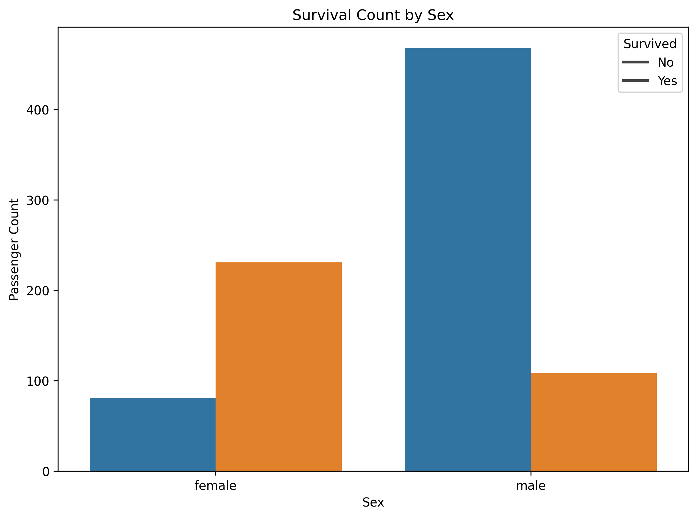

### Interpretation

Female passengers experienced substantially higher survival rates than male passengers. In contrast, the majority of male passengers did not survive. This indicates that passenger sex was one of the strongest factors associated with survival.

---

### Chart 2 – Survival by Passenger Class

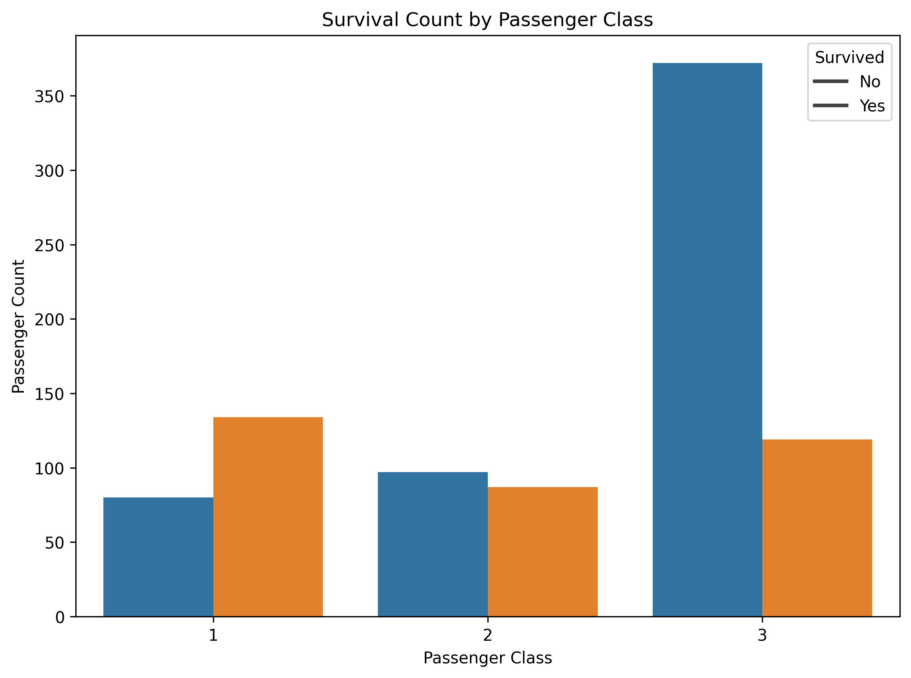

### Interpretation

Passengers travelling in first class experienced considerably better survival outcomes than those travelling in second and third class. The number of survivors decreases steadily from first class to third class. Passenger class therefore appears to have played a major role in determining survival.

---

### Chart 3 – Age Distribution by Survival

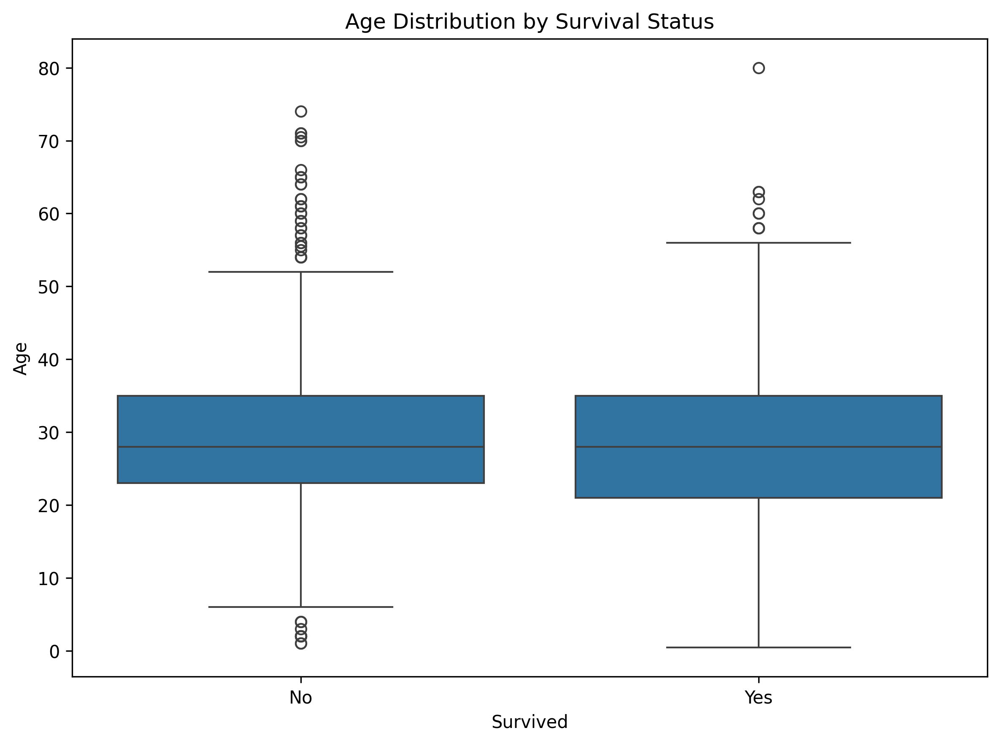

### Interpretation

The age distributions of survivors and non-survivors overlap considerably, although survivors exhibit a slightly lower median age. This suggests that age alone is not a strong predictor of survival. Compared with passenger sex and passenger class, age has a weaker relationship with survival.

---

### Chart 4 – Fare vs Age by Survival

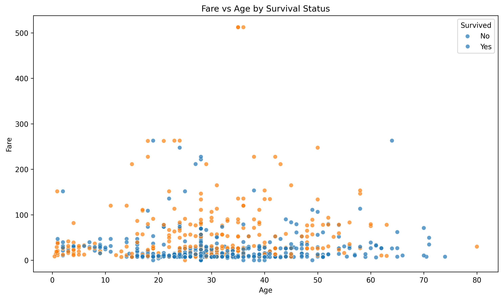

### Interpretation

Passengers paying higher fares were generally more likely to survive, reflecting the relationship between fare and passenger class. Survivors are observed across a wide range of ages, indicating that fare and passenger class are more influential than age alone. Together, these variables provide a clearer explanation of survival patterns than any single variable.

---

## Overall Data Story

The four visualizations collectively demonstrate that passenger sex and passenger class were the strongest determinants of survival. Female passengers and first-class passengers consistently experienced the highest survival rates. Age showed only a modest influence, while fare reinforced the importance of passenger class. Overall, the multivariate analysis indicates that socioeconomic status and passenger demographics played a significant role in survival outcomes.

---

## Outputs Generated

### Figures

```
outputs/figures/

survival_by_sex.png

survival_by_passenger_class.png

age_distribution_by_survival.png

fare_vs_age_survival.png
```

### Report

```
outputs/reports/

multivariate_story.md
```

---

# Task A.6 - Feature Standardization (EDA Sanity Check)

## Objective

The purpose of this task is to demonstrate feature standardization using z-score normalization as an exploratory data analysis (EDA) exercise. This standardization is performed solely to verify the transformation process and is **not** used in the predictive modeling pipeline implemented later.

---

## Standardization Method

The numerical features **Age** and **Fare** were standardized using Scikit-learn's `StandardScaler`.

The transformation applies the z-score formula:

```
z = (x - μ) / σ
```

where:

- μ is the feature mean
- σ is the feature standard deviation

The scaler was applied only to a copy of the cleaned dataset, ensuring that the original dataset remained unchanged.

---

## Before and After Comparison

The mean and standard deviation of each feature were compared before and after standardization.

| Feature | Before Mean | Before Std | After Mean | After Std |
|-----------|------------:|-----------:|-----------:|----------:|
| Age | 29.3152 | 12.9849 | 0.0000 | 1.0006 |
| Fare | 32.0967 | 49.6975 | 0.0000 | 1.0006 |

The transformed features have an approximate mean of **0** and standard deviation of **1**, confirming that standardization was applied successfully. The slight deviation from exactly **1.0000** is expected because `StandardScaler` computes the population standard deviation (`ddof=0`), whereas pandas reports the sample standard deviation (`ddof=1`).

---

## Distribution Comparison

### Age Standardization

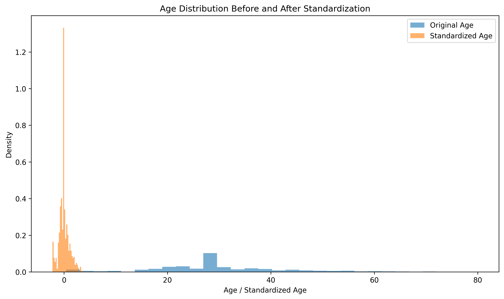

---

### Fare Standardization

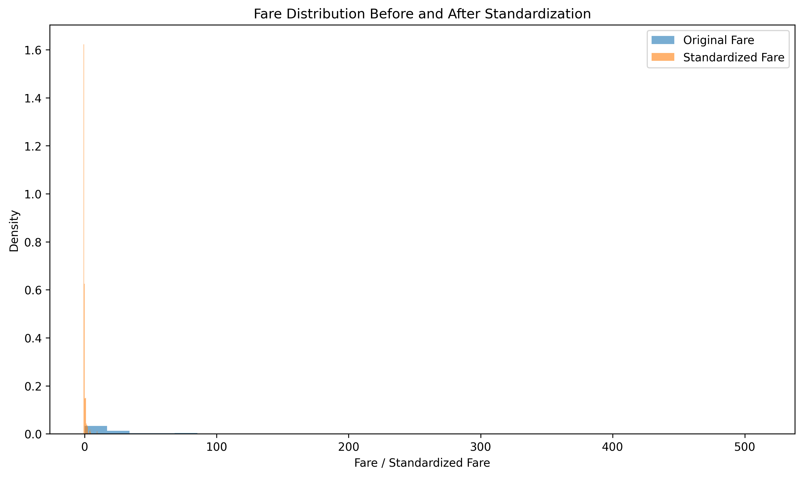

---

## Outputs Generated

### Figures

```
outputs/figures/

age_standardization.png

fare_standardization.png
```

### Report

```
outputs/reports/

standardization_summary.csv
```

---

## Key Findings

- Feature standardization successfully transformed both numerical variables to approximately zero mean and unit variance.
- The original cleaned dataset remained unchanged throughout the process.
- This exercise served purely as an exploratory validation step and intentionally remained separate from the predictive modeling pipeline.

---

# Generated Outputs

The analytics pipeline automatically generates the following artifacts.

## Figures

```
outputs/figures/

age_histogram.png
age_boxplot.png
fare_histogram.png
fare_boxplot.png
correlation_heatmap.png
survival_by_sex.png
survival_by_passenger_class.png
age_distribution_by_survival.png
fare_vs_age_survival.png
age_standardization.png
fare_standardization.png
```

---

## Reports

```
outputs/reports/

dataset_profile.csv
missing_value_handling_report.csv
univariate_statistics.csv
survival_rate_by_sex.csv
survival_rate_by_pclass.csv
survival_rate_by_sex_pclass.csv
correlation_matrix.csv
top_correlations.csv
multivariate_story.md
standardization_summary.csv
```

---

# Learning Outcomes

This module demonstrates the complete exploratory data analysis workflow for a real-world dataset.

The implementation includes:

- Dataset profiling and exploratory analysis.
- Rule-based missing value handling.
- Univariate statistical analysis.
- Bivariate relationship analysis.
- Correlation analysis and visualization.
- Multivariate storytelling using multiple charts.
- Feature standardization using z-score normalization.
- Modular Python application design.
- Automated report generation.
- Reproducible analytical workflows.

---

# Overall Conclusions

The exploratory analysis revealed several important insights regarding passenger survival.

- Female passengers experienced significantly higher survival rates than male passengers.
- First-class passengers consistently demonstrated the highest probability of survival.
- Passenger class and fare exhibited the strongest statistical relationship.
- Age showed only a moderate influence on survival compared with passenger class and sex.
- Standardization successfully transformed numerical variables while preserving the original dataset for future predictive modeling.

These findings establish a strong analytical foundation for **Module 2 Part B**, where predictive machine learning models will be developed using the cleaned Titanic dataset.

---

# Future Enhancements

Potential improvements for future work include:

- Additional feature engineering using family size and passenger titles.
- Feature selection based on statistical importance.
- Interactive dashboards using Plotly or Streamlit.
- Automated EDA report generation.
- Predictive modeling using multiple classification algorithms.
- Hyperparameter optimization and model deployment.

---